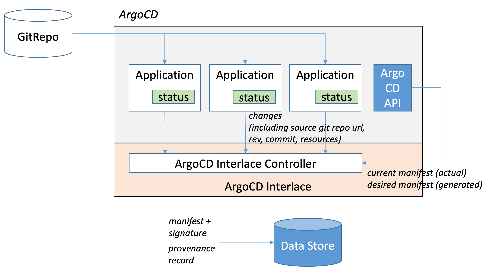

# ArgoCD Interlace

ArgoCD is widely used for enabling CD GitOps. ArgoCD internally builds manifest from source data in Git repository, and auto-sync it with target clusters. 

ArgoCD Interlace enhances ArgoCD capability from end-to-end software supply chain security viewpoint. Interlace adds authenticity of the manifest and the traceability to the source to ArgoCD.

ArgoCD Interlace works as a Kubernetes Custom Resource Definition (CRD) controller. Interlace monitors the trigger from state changes of Application resources on the ArgoCD cluster. When detecting new manifest build, Interlace sign the manifest, record the detail of manifest build such as the source files for the build, the command to produce the manifest for reproducibility. Interlace stores those details as provenance records in [in-toto](https://in-toto.io) format and upload it to [Sigstore](https://sigstore.dev/) log for verification.




The features are 
- Pluggable to ArgoCD
- Capture manifest and provenance from application.status automatically
- Sign manifest
- Record provenance in intoto format

### Installation
Prerequisite: Install [ArgoCD](https://argo-cd.readthedocs.io/en/stable/getting_started/) on your Kubernetes cluster before you install ArgoCD Interlace.


To install the latest version of ArgoCD Interlace to your cluster, run:
```
kubectl apply --filename https://raw.githubusercontent.com/IBM/argocd-interlace/main/releases/release.yaml
```
This creates a default installation of ArgoCD Interlace, however you will need futher setup for seeing it in action.

To verify that installation was successful, ensure Status of pod `argocd-interlace-controller` become `Running`:
```shell
$ kubectl get pod -n argocd-interlace -w
NAME                                              READY   STATUS    RESTARTS   AGE
pod/argocd-interlace-controller-f57fd69fb-72l4h   1/1     Running   0          19m
```

### Setup

To complete setting up ArgoCD Interlace, configure the followings: 
* [OCI image registry authentication](oci_setup.md)
  Interlace generates OCI images that need to be pushed an image Registry.
* [ArgoCD REST API authentication](argo_setup.md)
  Interlace queries ArgoCD REST API to retrive desired manifest for an application
* [Cosign based signing keys](signing_key_setup.md)
  Interlace requires signing keys for creating signature for desired manifest.

## Example Scenario
To see ArgoCD Interlace in action, check the [example scenario](example_scenario.md).


 Demo
 